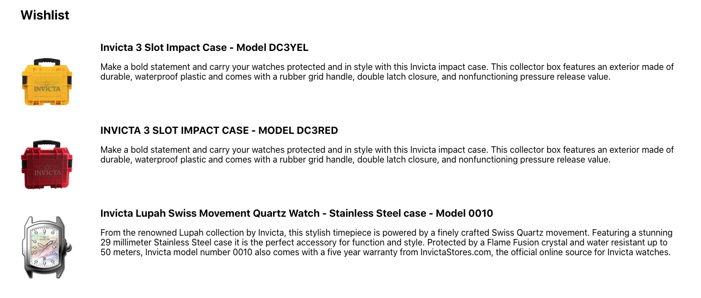

📢 Use this project, [contribute](https://github.com/vtex-apps/quick-order) to it or open issues to help evolve it using [Store Discussion](https://github.com/vtex-apps/store-discussion).

# Wishlist

<!-- ALL-CONTRIBUTORS-BADGE:START - Do not remove or modify this section -->
[](#contributors-)
<!-- ALL-CONTRIBUTORS-BADGE:END -->

The Wishlist app is designed for **B2C**. It adds a heart icon to the Shelfs and Product Page, so the user can add it to the Wishlist, you can list all the Wishlisted items at `/wishlist`. This is the version `0` for the new VTEX IO platform, which means we'll add many other features and improvements in the further versions.




## Configuration

1. Add the `vtex.wish-list` app to your theme's dependencies in `manifest.json`. For example:

```diff
  dependencies: {
+   "vtex.wish-list": "0.x"
  }
```

Once Wishlist is added as a dependency, a new route called `/wishlist` will be automatically created for your store, allowing the user to list all the "Wishlisted" products. 

:warning: This app increment the standard VTEX shelf and product blocks with content using abstract interfaces from `vtex.wish-list` . The **VTEX wishlist block** is:

- `"add-to-list-btn"`: This block can be added to the product page (`store.product`) and shelf (`product-summary.shelf`). It renders a heart icon to the block.


## Modus Operandi

As said previously, after configured the user will be able to see a Heart icon to the shelf and product page, you'll also be able to access the Wishlisted items at `/wishlist`


## Customization

In order to apply CSS customizations to this and other blocks, follow the instructions given in the recipe on [Using CSS Handles for store customization](https://vtex.io/docs/recipes/style/using-css-handles-for-store-customization).

| CSS Handles |
| ---------------------------- |
| `wishlistIconContainer` |
| `wishlistIcon` |
| `wishlistContainer` |
| `listTab` |
| `listName` |
| `listItemsContainer` |
| `productItemRow` |
| `linkThumb` |
| `columnThumb` |
| `thumb` |
| `linkText` |
| `columnText` |
| `productTitle` |
| `productDescription` |

<!-- ## Upcoming features

- Create custom lists
- Make your lists public
- Share your list
- Choose  your wishlist icon
- Wishlist page with lists management
- Wishlist page with products using the default shelf format -->


  
<!-- DOCS-IGNORE:start -->

## Contributors ✨

Thanks goes to these wonderful people:

<!-- ALL-CONTRIBUTORS-LIST:START - Do not remove or modify this section -->
<!-- prettier-ignore-start -->
<!-- markdownlint-disable -->
<!-- markdownlint-enable -->
<!-- prettier-ignore-end -->
<!-- ALL-CONTRIBUTORS-LIST:END -->

This project follows the [all-contributors](https://github.com/all-contributors/all-contributors) specification. Contributions of any kind are welcome!

<!-- DOCS-IGNORE:end -->
